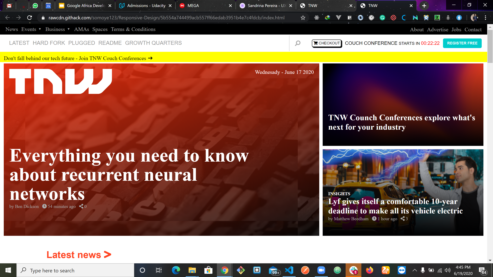

# Responsive Design

Building with responsive design

Building THE NEXT WEB with responsive design
## Built With

- HTML,
- CSS,

## Live Demo

[Live Demo Link](https://rawcdn.githack.com/OlawaleJoseph/design-teardown/539a5721ffa1f8dac2d1e5a93c0d7c652b07f2ce/index.html)

## Authors

👤 **Somoye**

- Github: [@githubhandle](https://github.com/somoye123)

👤 **Olawale**

- Github: [@githubhandle](https://github.com/OlawaleJoseph)

## Testing

- Clone this repo
- cd into the cloned repo
- Open the index.html file on google chrome browser or any anyother browser

## 🤝 Contributing

Contributions, issues and feature requests are welcome!

Feel free to check the [issues page](issues/).

## Show your support

Give a ⭐️ if you like this project!

## Acknowledgments

- Hat tip to anyone whose code was used
- Inspiration
- etc

## 📝 License

This project is [MIT](lic.url) licensed.
